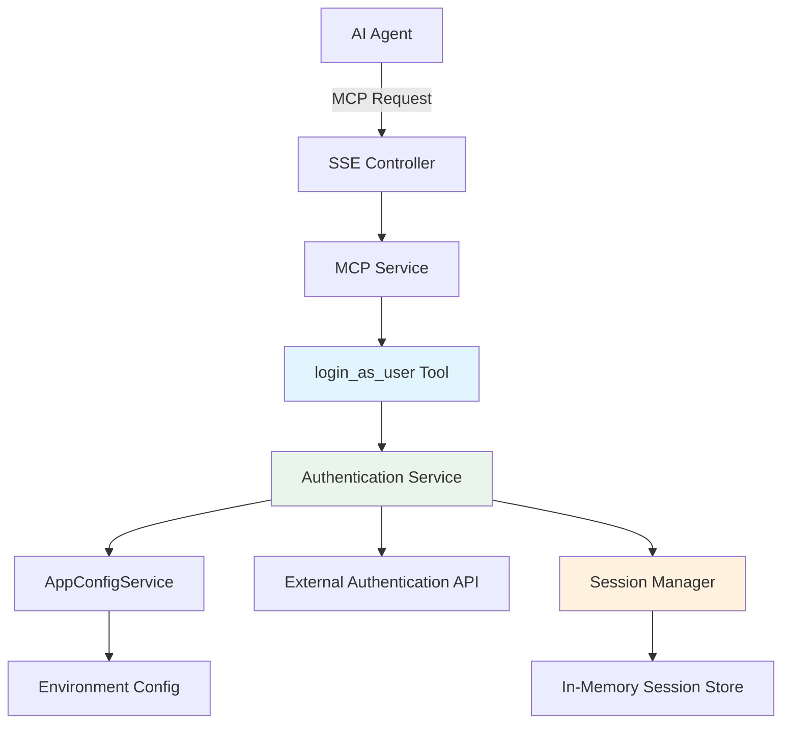

# Business Requirements Document (BRD)
## `login_as_user` MCP Tool Implementation

### Table of Contents
1. [Executive Summary](#executive-summary)
2. [Project Overview](#project-overview)
3. [Business Objectives](#business-objectives)
4. [Stakeholder Analysis](#stakeholder-analysis)
5. [Scope Definition](#scope-definition)
6. [Functional Requirements](#functional-requirements)
7. [Non-Functional Requirements](#non-functional-requirements)
8. [Technical Architecture](#technical-architecture)
9. [Assumptions and Dependencies](#assumptions-and-dependencies)
10. [Constraints](#constraints)
11. [Risk Assessment](#risk-assessment)
12. [Success Metrics](#success-metrics)
13. [Implementation Approach](#implementation-approach)

---

## 1. Executive Summary

The `login_as_user` MCP (Model Context Protocol) tool is a critical enhancement to the existing cx-mcp-server application that will enable AI agents to authenticate as specific users within the customer experience system. This tool will work in conjunction with the existing `list_users` tool to provide a complete user impersonation workflow for AI-driven operations.

### Business Justification
- **Operational Efficiency**: Enables AI agents to perform user-specific operations without manual authentication steps
- **System Integration**: Creates seamless workflow between user discovery and user authentication
- **Scalability**: Supports automated customer experience operations at scale
- **Security**: Maintains proper authentication controls while enabling programmatic access

### Key Deliverables
- New `login_as_user` MCP tool implementation
- Authentication service integration
- Session management system
- Comprehensive error handling and validation
- Unit tests and integration tests
- Documentation updates

---

## 2. Project Overview

### Background
The cx-mcp-server currently provides the `list_users` tool that retrieves comprehensive user account data including professional licenses and available roles. However, there is no mechanism for AI agents to authenticate as a specific user to perform operations in that user's context. This creates a workflow gap that limits the system's automation capabilities.

### Current System Analysis
Based on codebase analysis:
- **Existing Tools**: `list_users` (user discovery), `get_data` (HTTP requests)
- **Architecture**: NestJS application with MCP server capabilities
- **Authentication**: Session-based authentication (receives 403 NOT_LOGGED_IN errors)
- **External Services**: Uses UserAccountService for API integration
- **Error Handling**: Comprehensive error handling with standardized response formats

### Project Context
This tool is part of the broader customer experience automation initiative and will enable:
- AI agents to authenticate as specific users
- Subsequent API calls to be made in the authenticated user's context
- End-to-end automation of customer experience workflows

---

## 3. Business Objectives

### Primary Objectives
1. **Enable User Impersonation**: Allow AI agents to authenticate as specific users selected from `list_users` results
2. **Seamless Integration**: Integrate seamlessly with existing MCP tool architecture and patterns
3. **Operational Continuity**: Ensure authenticated sessions persist for subsequent operations
4. **Security Compliance**: Maintain security standards while enabling programmatic authentication

### Secondary Objectives
1. **Developer Experience**: Provide clear, consistent API patterns following existing conventions
2. **System Reliability**: Implement robust error handling and timeout management
3. **Monitoring Capability**: Enable proper logging and monitoring of authentication events
4. **Future Extensibility**: Design for future authentication method extensions

### Business Value
- **Reduced Manual Intervention**: Eliminate need for manual login steps in automated workflows
- **Improved Response Times**: Enable faster customer experience operations
- **Enhanced Scalability**: Support higher volumes of automated operations
- **Better User Experience**: Provide seamless AI-driven customer service

---

## 4. Stakeholder Analysis

### Primary Stakeholders
- **Development Team**: Responsible for implementation, testing, and maintenance
- **Product Owner**: Defines requirements and acceptance criteria
- **System Architects**: Ensure alignment with overall system architecture
- **DevOps Team**: Handle deployment and monitoring infrastructure

### Secondary Stakeholders
- **Customer Experience Team**: End users of the AI automation capabilities
- **Security Team**: Ensure authentication security standards are met
- **External Service Providers**: Backend services that provide authentication endpoints
- **AI/ML Engineers**: Users of the MCP tools for building AI agents

### Stakeholder Interests
- **Development Team**: Clear requirements, maintainable code, comprehensive testing
- **Product Owner**: Feature completeness, user value, timeline adherence
- **Security Team**: Secure authentication, audit trails, compliance
- **Customer Experience Team**: Reliable automation, improved efficiency

---

## 5. Scope Definition

### In Scope
1. **Core Authentication Tool**
   - Implementation of `login_as_user` MCP tool
   - Integration with existing MCP server architecture
   - User authentication via accountUuid parameter

2. **Session Management**
   - Authentication session creation and management
   - Session persistence for subsequent requests
   - Session timeout and cleanup handling

3. **Error Handling**
   - Comprehensive error handling following existing patterns
   - Standardized error response formats
   - Network error and timeout management

4. **Integration Components**
   - Integration with AppConfigService for URL management
   - Integration with existing external services architecture
   - Validation using class-validator patterns

5. **Testing and Documentation**
   - Unit tests for all new components
   - Integration tests for authentication flows
   - Code documentation and API documentation updates

### Out of Scope
1. **Authentication Method Changes**: No changes to underlying authentication mechanisms
2. **User Management**: No user creation, modification, or deletion capabilities
3. **Authorization Logic**: No changes to existing role-based access controls
4. **UI Components**: No user interface components (tool operates via MCP protocol)
5. **Audit System**: Detailed audit logging system (basic logging only)

### Exclusions
- Multi-factor authentication support
- Single Sign-On (SSO) integration
- Password management functionality
- User profile management
- Advanced session analytics

---

## 6. Functional Requirements

### FR-001: User Authentication Tool
**Description**: Implement `login_as_user` MCP tool that accepts user identifier and performs authentication

**Acceptance Criteria**:
- Tool accepts `accountUuid` parameter from `list_users` response
- Tool calls appropriate authentication endpoint
- Tool returns standardized success/error response
- Tool follows existing MCP tool patterns and conventions

**Input Schema**:
```typescript
{
  type: 'object',
  properties: {
    accountUuid: {
      type: 'string',
      description: 'Unique identifier for the user account to authenticate as'
    }
  },
  required: ['accountUuid']
}
```

### FR-002: Authentication Service Integration
**Description**: Create service component for handling user authentication requests

**Acceptance Criteria**:
- Service integrates with AppConfigService for URL construction
- Service follows existing error handling patterns from UserAccountService
- Service implements 5-second timeout for requests
- Service handles HTTP status codes appropriately

**Technical Specifications**:
- Use existing fetch-based HTTP client pattern
- Implement AbortController for timeout handling
- Return standardized response format
- Log authentication attempts and results

### FR-003: Session Management
**Description**: Manage authentication sessions for subsequent API requests

**Acceptance Criteria**:
- Authentication response includes session token/cookie
- Session information is stored for subsequent requests
- Session expiration is handled gracefully
- Multiple concurrent sessions are supported if needed

### FR-004: Input Validation
**Description**: Validate input parameters using class-validator

**Acceptance Criteria**:
- AccountUuid parameter is validated as non-empty string
- Invalid inputs return clear validation error messages
- Validation follows existing DTO patterns
- Validation errors are properly logged

### FR-005: Error Handling
**Description**: Comprehensive error handling following existing patterns

**Acceptance Criteria**:
- Network errors are handled with appropriate messages
- HTTP errors return standardized error responses
- Timeout errors are handled with specific messaging
- Authentication failures are clearly identified
- All errors are properly logged with appropriate log levels

**Error Types to Handle**:
- Network connectivity errors
- Timeout errors (5-second timeout)
- HTTP 4xx client errors
- HTTP 5xx server errors
- Invalid accountUuid errors
- Authentication endpoint not found errors

### FR-006: Response Format
**Description**: Return standardized response format consistent with existing tools

**Success Response**:
```typescript
{
  success: true,
  data: {
    accountUuid: string,
    sessionToken?: string,
    expiresAt?: string,
    message: string
  },
  operation: 'login_as_user',
  timestamp: string
}
```

**Error Response**:
```typescript
{
  success: false,
  error: {
    type: 'CLIENT_ERROR' | 'SERVER_ERROR' | 'NETWORK_ERROR',
    statusCode: number,
    message: string,
    details?: unknown
  },
  operation: 'login_as_user',
  timestamp: string
}
```

---

## 7. Non-Functional Requirements

### Performance Requirements
- **Response Time**: Tool must respond within 10 seconds under normal conditions
- **Timeout Handling**: 5-second timeout for authentication requests (consistent with existing tools)
- **Throughput**: Support minimum 10 concurrent authentication requests
- **Resource Usage**: Memory usage should not exceed 50MB per authentication session

### Security Requirements
- **Authentication**: Use existing secure authentication mechanisms
- **Session Security**: Sessions must use secure token/cookie mechanisms
- **Input Validation**: All inputs must be validated and sanitized
- **Error Information**: Error messages must not expose sensitive authentication details
- **Logging**: Authentication attempts must be logged (excluding sensitive data)

### Reliability Requirements
- **Availability**: 99.9% uptime for authentication functionality
- **Error Recovery**: Graceful handling of network and service failures
- **Session Persistence**: Sessions must persist across service restarts where possible
- **Fault Tolerance**: Continue operation even if some authentication attempts fail

### Scalability Requirements
- **Concurrent Users**: Support minimum 50 concurrent authentication sessions
- **Load Handling**: Handle authentication requests during peak usage
- **Resource Scaling**: Linear resource usage scaling with concurrent sessions
- **Performance Degradation**: Graceful performance degradation under high load

### Maintainability Requirements
- **Code Quality**: Follow existing TypeScript and NestJS patterns
- **Documentation**: Comprehensive code documentation and API documentation
- **Testing**: Minimum 90% code coverage for new components
- **Monitoring**: Integration with existing logging and monitoring systems

---

## 8. Technical Architecture

### System Architecture



### Component Design

#### AuthenticationService
- **Purpose**: Handle user authentication requests to external service
- **Dependencies**: AppConfigService, Logger
- **Methods**:
  - `authenticateAsUser(accountUuid: string): Promise<AuthenticationResponse>`
  - `validateSession(sessionToken: string): Promise<boolean>`
  - `handleAuthenticationError(response: Response): Promise<AuthenticationErrorResponse>`
  - `handleNetworkError(error: unknown): AuthenticationErrorResponse`

#### SessionManager
- **Purpose**: Manage authentication sessions
- **Dependencies**: Logger
- **Methods**:
  - `createSession(accountUuid: string, sessionData: SessionData): void`
  - `getSession(sessionToken: string): SessionData | null`
  - `deleteSession(sessionToken: string): void`
  - `cleanupExpiredSessions(): void`

#### LoginAsUserTool
- **Purpose**: MCP tool definition and validation
- **Structure**: Tool definition with input schema following existing patterns
- **Integration**: Registered in MCP service alongside existing tools

### Data Flow

1. **Authentication Request**: AI agent sends MCP request with accountUuid
2. **Input Validation**: Tool validates accountUuid parameter
3. **Service Call**: AuthenticationService calls external authentication endpoint
4. **Session Creation**: SessionManager creates and stores session data
5. **Response**: Standardized success/error response returned to AI agent
6. **Session Usage**: Subsequent requests use session token for authenticated operations

### Integration Points

#### With Existing Systems
- **MCP Service**: Register new tool in existing tool handlers
- **AppConfigService**: Add new URL construction method for authentication endpoint
- **External Services Module**: Extend module to include AuthenticationService
- **Error Handling**: Use existing error handling patterns and interfaces

#### Configuration Requirements
- **Environment Variables**: Add authentication endpoint configuration
- **URL Construction**: Follow existing pattern for external service URLs
- **Timeout Configuration**: Use existing 5-second timeout standard

---

## 9. Assumptions and Dependencies

### Technical Assumptions
1. **External Authentication Endpoint**: Assumes external service provides REST API endpoint for user authentication
2. **Session-Based Authentication**: Assumes backend uses session-based authentication (cookies/tokens)
3. **AccountUuid Validity**: Assumes accountUuid from `list_users` is valid for authentication
4. **Network Connectivity**: Assumes reliable network connectivity to external services
5. **Environment Configuration**: Assumes BACKEND_HOSTNAME environment variable includes authentication endpoints

### Business Assumptions
1. **User Consent**: Assumes users have consented to AI agent impersonation
2. **Security Approval**: Assumes security team has approved programmatic authentication approach
3. **Service Availability**: Assumes external authentication service maintains acceptable uptime
4. **Authentication Method**: Assumes current authentication method will remain stable

### Dependencies

#### External Dependencies
- **Backend Authentication Service**: External service must provide authentication endpoint
- **Network Infrastructure**: Reliable network connectivity required
- **Environment Configuration**: Proper configuration of BACKEND_HOSTNAME required

#### Internal Dependencies
- **Existing MCP Infrastructure**: Depends on current MCP server implementation
- **UserAccountService**: Uses existing patterns and infrastructure
- **AppConfigService**: Requires extension for new URL endpoints
- **Logging Infrastructure**: Uses existing NestJS logging system

#### Development Dependencies
- **TypeScript**: Continues using TypeScript for type safety
- **class-validator**: For input validation following existing patterns
- **class-transformer**: For DTO transformation
- **NestJS Framework**: Core framework dependency
- **Jest**: For unit and integration testing

### Critical Path Dependencies
1. **Authentication Endpoint Discovery**: Must identify correct external authentication endpoint
2. **Session Token Format**: Must understand session token/cookie format from backend
3. **Error Response Format**: Must understand error response formats from backend
4. **Testing Environment**: Requires test environment with working authentication service

---

## 10. Constraints

### Technical Constraints
1. **Existing Architecture**: Must integrate with existing NestJS and MCP architecture
2. **Response Format**: Must follow existing standardized response format patterns
3. **Error Handling**: Must use existing error handling patterns and interfaces
4. **Timeout Limits**: Must adhere to 5-second timeout constraint for consistency
5. **Memory Usage**: Must not significantly increase application memory footprint

### Security Constraints
1. **Authentication Method**: Cannot modify existing backend authentication mechanisms
2. **Session Security**: Must use secure session management practices
3. **Input Validation**: Must validate all inputs to prevent injection attacks
4. **Error Information**: Cannot expose sensitive authentication details in error messages
5. **Audit Requirements**: Must log authentication attempts without exposing credentials

### Environmental Constraints
1. **Backend Service**: Dependent on external backend service availability and API stability
2. **Network Environment**: Must work within existing network security constraints
3. **Configuration Management**: Must use existing environment variable management
4. **Deployment Pipeline**: Must fit within existing CI/CD pipeline and deployment processes

### Resource Constraints
1. **Development Time**: Implementation must be completed within allocated development sprint cycles
2. **Testing Resources**: Must use existing testing infrastructure and patterns
3. **Documentation**: Must follow existing documentation standards and formats
4. **Performance Impact**: Must not significantly impact existing application performance

### Regulatory Constraints
1. **Data Privacy**: Must comply with data privacy regulations for user impersonation
2. **Security Standards**: Must meet organizational security standards for authentication
3. **Audit Requirements**: Must provide adequate audit trail for authentication events
4. **Compliance**: Must maintain compliance with existing organizational policies

---

## 11. Risk Assessment

### High-Risk Items

#### Risk 1: Authentication Endpoint Unknown
- **Impact**: High - Cannot implement tool without knowing authentication endpoint
- **Probability**: Medium
- **Mitigation**: Early discovery phase to identify correct authentication endpoint through API documentation review and backend team consultation
- **Contingency**: Implement mock authentication service for development if real endpoint unavailable

#### Risk 2: Session Management Complexity
- **Impact**: High - Incorrect session handling could break subsequent operations
- **Probability**: Medium
- **Mitigation**: Thorough analysis of existing session mechanisms and comprehensive testing of session persistence
- **Contingency**: Implement stateless authentication if session management proves too complex

#### Risk 3: Security Vulnerabilities
- **Impact**: Critical - Authentication vulnerabilities could compromise system security
- **Probability**: Low
- **Mitigation**: Security review of implementation, input validation, and secure session handling
- **Contingency**: Additional security testing and potential security audit

### Medium-Risk Items

#### Risk 4: External Service Dependency
- **Impact**: Medium - Tool unusable if external authentication service is down
- **Probability**: Medium
- **Mitigation**: Implement robust error handling and retry mechanisms
- **Contingency**: Graceful degradation with clear error messages

#### Risk 5: Performance Impact
- **Impact**: Medium - Additional authentication requests could impact system performance
- **Probability**: Low
- **Mitigation**: Efficient session caching and connection pooling
- **Contingency**: Performance optimization and caching strategies

#### Risk 6: Integration Complexity
- **Impact**: Medium - Complex integration could delay delivery
- **Probability**: Low
- **Mitigation**: Follow existing patterns and conduct incremental integration testing
- **Contingency**: Simplified implementation approach if complexity exceeds estimates

### Low-Risk Items

#### Risk 7: Documentation Gaps
- **Impact**: Low - Could affect maintainability
- **Probability**: Low
- **Mitigation**: Comprehensive documentation during development
- **Contingency**: Post-implementation documentation sprint

#### Risk 8: Testing Environment Issues
- **Impact**: Low - Could delay testing phase
- **Probability**: Low
- **Mitigation**: Early testing environment setup and validation
- **Contingency**: Mock service implementation for testing

### Risk Monitoring
- **Weekly Risk Reviews**: Assess risk status during sprint planning
- **Early Warning Indicators**: Monitor external service availability and authentication success rates
- **Escalation Procedures**: Clear escalation path for critical risks to project stakeholders

---

## 12. Success Metrics

### Primary Success Metrics

#### Functional Success
1. **Authentication Success Rate**: ≥ 95% successful authentication attempts under normal conditions
2. **Response Time**: ≤ 5 seconds average response time for authentication requests
3. **Error Handling Coverage**: 100% of identified error scenarios handled gracefully
4. **Integration Success**: Tool successfully integrates with existing MCP infrastructure without breaking changes

#### Technical Success
1. **Code Coverage**: ≥ 90% test coverage for new authentication components
2. **Performance Impact**: ≤ 5% increase in application memory usage
3. **Reliability**: ≤ 0.1% authentication request failure rate due to implementation issues
4. **Security Compliance**: 100% compliance with security review requirements

### Secondary Success Metrics

#### User Experience
1. **Error Message Clarity**: User-friendly error messages for all failure scenarios
2. **Documentation Quality**: Complete and accurate API documentation
3. **Developer Experience**: Seamless integration experience for AI agent developers

#### Operational Success
1. **Monitoring Coverage**: All authentication events properly logged and monitored
2. **Maintenance Effort**: ≤ 2 hours per month average maintenance effort
3. **Support Requests**: ≤ 1 support request per week related to authentication tool

### Measurement Methods

#### Automated Metrics
- **Performance Monitoring**: Application performance monitoring for response times and error rates
- **Log Analysis**: Automated log analysis for authentication success/failure rates
- **Test Coverage Reports**: Automated test coverage reporting in CI/CD pipeline

#### Manual Metrics
- **Security Review**: Manual security review with checklist completion
- **Documentation Review**: Manual review of documentation completeness and accuracy
- **Integration Testing**: Manual testing of integration with existing systems

### Success Criteria Timeline
- **Week 1-2**: Technical implementation with >80% test coverage
- **Week 3**: Security review completion and compliance verification
- **Week 4**: Integration testing and performance validation
- **Week 5**: Documentation completion and success metrics validation

---

## 13. Implementation Approach

### Development Methodology
Following existing project patterns and NestJS best practices:

1. **Incremental Development**: Implement in small, testable increments
2. **Test-Driven Development**: Write tests before implementation where possible
3. **Code Review Process**: All code changes reviewed by team members
4. **Continuous Integration**: Use existing CI/CD pipeline for automated testing

### Implementation Phases

#### Phase 1: Foundation (Week 1)
**Objectives**: Set up basic infrastructure and service skeleton
**Deliverables**:
- AuthenticationService class with basic structure
- LoginAsUserDto for input validation
- Authentication response interfaces
- Basic unit tests structure

**Tasks**:
1. Create AuthenticationService in `external-services/services/`
2. Define authentication DTOs and interfaces
3. Extend AppConfigService with authentication URL method
4. Set up unit test files with initial test cases

#### Phase 2: Core Implementation (Week 2)
**Objectives**: Implement core authentication functionality
**Deliverables**:
- Complete AuthenticationService implementation
- MCP tool registration and handler
- Error handling implementation
- Unit tests for all components

**Tasks**:
1. Implement authentication HTTP request logic
2. Integrate with MCP service tool handlers
3. Implement error handling following existing patterns
4. Complete unit tests for all new components

#### Phase 3: Session Management (Week 3)
**Objectives**: Implement session management and persistence
**Deliverables**:
- SessionManager implementation
- Session storage and retrieval
- Session cleanup and expiration handling
- Integration tests

**Tasks**:
1. Implement SessionManager class
2. Integrate session management with authentication flow
3. Add session cleanup mechanisms
4. Create integration tests for authentication flow

#### Phase 4: Integration and Testing (Week 4)
**Objectives**: Complete system integration and comprehensive testing
**Deliverables**:
- Full integration with existing MCP infrastructure
- Comprehensive test suite
- Performance testing results
- Security review completion

**Tasks**:
1. Complete integration with existing systems
2. Run comprehensive test suite including edge cases
3. Conduct performance testing and optimization
4. Security review and vulnerability assessment

#### Phase 5: Documentation and Deployment (Week 5)
**Objectives**: Complete documentation and prepare for deployment
**Deliverables**:
- Updated API documentation
- Code documentation completion
- Deployment guide updates
- Success metrics validation

**Tasks**:
1. Update CLAUDE.md with new tool information
2. Complete code documentation and comments
3. Validate all success metrics
4. Prepare deployment documentation

### Technical Implementation Details

#### File Structure
```
cx-mcp-server/src/
├── configs/
│   ├── mcp/
│   │   ├── dto/
│   │   │   └── authentication.dto.ts          # New
│   │   └── tools/
│   │       └── authentication.tools.ts        # New
│   └── app-config.service.ts                  # Modified
├── external-services/
│   └── services/
│       ├── authentication.service.ts          # New
│       └── authentication.service.spec.ts     # New
├── interfaces/
│   └── authentication.interface.ts            # New
└── session/
    ├── session.service.ts                     # New
    └── session.service.spec.ts                # New
```

#### Key Implementation Patterns
1. **Follow Existing Patterns**: Use UserAccountService as template for HTTP requests and error handling
2. **Dependency Injection**: Leverage NestJS dependency injection for service integration
3. **Validation**: Use class-validator for input validation following existing DTO patterns
4. **Error Handling**: Implement standardized error responses using existing interfaces
5. **Logging**: Use NestJS Logger with appropriate log levels

### Quality Assurance

#### Testing Strategy
1. **Unit Tests**: Test all service methods individually
2. **Integration Tests**: Test complete authentication flow
3. **Error Scenario Testing**: Test all error conditions and edge cases
4. **Performance Testing**: Validate response times and resource usage
5. **Security Testing**: Validate input sanitization and secure session handling

#### Code Quality Standards
1. **TypeScript**: Strict TypeScript compilation with no `any` types
2. **ESLint**: Pass all linting rules defined in project
3. **Prettier**: Code formatting consistent with project standards
4. **SOLID Principles**: Follow SOLID design principles
5. **DRY Principle**: Avoid code duplication

### Deployment Strategy
1. **Staging Deployment**: Deploy to staging environment for testing
2. **Integration Testing**: Run full integration test suite in staging
3. **Performance Validation**: Validate performance metrics in staging
4. **Production Deployment**: Deploy to production following existing deployment procedures
5. **Monitoring**: Monitor authentication success rates and performance post-deployment

### Rollback Plan
1. **Feature Flag**: Implement feature flag to disable tool if issues arise
2. **Version Control**: Use git tags for easy rollback to previous version
3. **Database Rollback**: No database changes required, service-level rollback only
4. **Communication Plan**: Clear communication to stakeholders in case of rollback

---

## Conclusion

This Business Requirements Document provides comprehensive guidance for implementing the `login_as_user` MCP tool within the existing cx-mcp-server architecture. The implementation follows established patterns and integrates seamlessly with existing systems while providing robust authentication capabilities for AI agents.

The success of this project depends on careful attention to security considerations, thorough testing, and adherence to existing architectural patterns. Regular stakeholder communication and risk monitoring will ensure successful delivery within the specified timeline and budget constraints.

**Document Version**: 1.0  
**Last Updated**: 2025-08-01  
**Next Review Date**: 2025-08-15